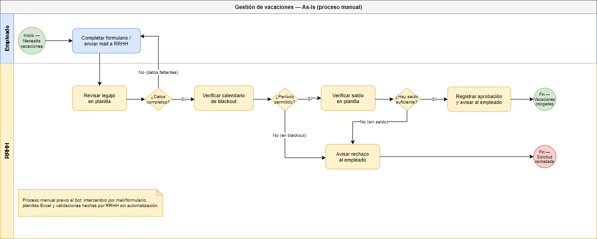
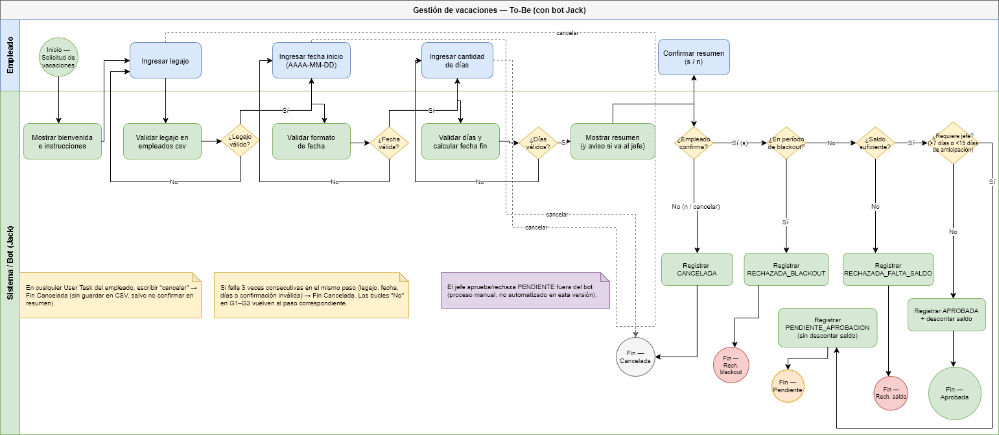

# TPI — Automatización del proceso de vacaciones

**Materia:** Organización Empresarial — UTN TUP (1.er año, 2026 1C)  
**Alumno:** Leandro Traficante  
**Proceso:** Gestión de solicitudes de vacaciones (simulación con chatbot en consola)

Bot en consola (**Jack**) que guía al empleado paso a paso, valida reglas de negocio y persiste los resultados en archivos CSV (base de datos simulada).

---

## Requisitos

- **Python 3.10+** (recomendado 3.11 o superior)
- Solo biblioteca estándar (`csv`, `datetime`, `pathlib`) — no hace falta `pip install`
- Ejecutar siempre desde la **raíz del proyecto** (donde está este README)

---

## Cómo ejecutar

```bash
python src/bot_vacaciones.py
```

En Windows, si `python` no funciona:

```bash
py src/bot_vacaciones.py
```

Si en la consola de Windows ves caracteres raros en lugar de tildes (por ejemplo `das` en vez de `días`), el bot intenta usar UTF-8 al iniciar. Si persiste, ejecutá antes: `chcp 65001`, o usá Windows Terminal con perfil UTF-8.

---

## Manual de usuario (uso del bot)

1. El bot saluda y explica que podés escribir **`cancelar`** en cualquier momento para salir.
2. **Legajo:** número de empleado (ej. `1001`).
3. **Fecha de inicio:** formato `AAAA-MM-DD` (ej. `2026-10-10`). No puede ser anterior a hoy.
4. **Cantidad de días:** entero mayor a cero.
5. **Resumen:** el bot muestra fechas, días y saldo; respondé **`s`** para confirmar o **`n`** para no confirmar.
6. El bot valida en este orden: **períodos bloqueados (blackout)** → **saldo** → **reglas de jefe** → **aprobación automática** (si corresponde).

### Comandos y reglas de entrada

| Acción              | Qué escribir                                                              |
| ------------------- | ------------------------------------------------------------------------- |
| Confirmar solicitud | `s`                                                                       |
| No confirmar        | `n`                                                                       |
| Salir del proceso   | `cancelar` (en cualquier paso)                                            |
| Errores repetidos   | Tras **3 intentos fallidos** en el mismo paso, el bot cierra la solicitud |

### Reglas de negocio

| Condición                                                                | Resultado                                                                        |
| ------------------------------------------------------------------------ | -------------------------------------------------------------------------------- |
| Fechas en período de `blackout.csv`                                      | `RECHAZADA_BLACKOUT`                                                             |
| Días pedidos > saldo disponible                                          | `RECHAZADA_FALTA_SALDO`                                                          |
| Más de **7 días** **o** inicio en menos de **15 días** desde hoy         | `PENDIENTE_APROBACION` (el jefe revisa **fuera del bot**; no se descuenta saldo) |
| ≤ 7 días, inicio con ≥ 15 días de anticipación, sin blackout y con saldo | `APROBADA` (descuenta saldo al instante)                                         |

El bot implementa **solo el carril Empleado ↔ Sistema**. La aprobación del jefe no está automatizada en esta versión.

### Ejemplo de conversación (aprobación automática)

```
Jack: ¿Cuál es tu número de legajo?
Vos: 1001

Jack: ¿Desde qué fecha querés tomarte las vacaciones? ... AAAA-MM-DD
Vos: 2026-10-10

Jack: ¿Cuántos días de vacaciones necesitás?
Vos: 3

Jack: ... ¿Confirmás que los datos son correctos? (s/n)
Vos: s

Jack: ¡Genial, Juan Pérez! Tu solicitud quedó aprobada al instante...
```

Manual de usuario completo: [docs/manual-usuario.md](docs/manual-usuario.md).

---

## Datos de prueba (`data/`)

### Empleados (`empleados.csv`)

| Legajo | Nombre       | Saldo (días) |
| ------ | ------------ | ------------ |
| 1001   | Juan Pérez   | 73           |
| 1002   | María Gómez  | 2            |
| 1003   | Carlos López | 0            |
| 1004   | Ana Martínez | 10           |

- **Sin saldo:** legajo `1003` o pedir más días que el saldo de otro empleado.
- **Pendiente de jefe:** más de 7 días, o fecha de inicio a menos de 15 días desde hoy (ej. hoy + 10 días).

### Períodos bloqueados (`blackout.csv`)

| Desde      | Hasta      | Motivo               |
| ---------- | ---------- | -------------------- |
| 2026-12-22 | 2027-01-05 | Cierre de fin de año |
| 2026-07-01 | 2026-07-15 | Inventario general   |

Ejemplo de rechazo por blackout: legajo `1004`, fecha `2026-07-05`, 3 días.

### Historial (`solicitudes.csv`)

Cada solicitud confirmada o rechazada por reglas de negocio genera una fila con `id`, fechas, `estado` y `motivo`. Detalle de columnas: [docs/diccionario-datos.md](docs/diccionario-datos.md).

### Estados posibles en `solicitudes.csv`

| Estado                  | Significado                                                     |
| ----------------------- | --------------------------------------------------------------- |
| `APROBADA`              | Aprobación automática; saldo descontado en `empleados.csv`      |
| `PENDIENTE_APROBACION`  | Requiere jefe; saldo **sin** descontar                          |
| `RECHAZADA_BLACKOUT`    | Fechas en período bloqueado                                     |
| `RECHAZADA_FALTA_SALDO` | Saldo insuficiente                                              |
| `CANCELADA`             | Usuario canceló, no confirmó o superó intentos (si se registró) |

---

## Documentación del proyecto

| Documento                                              | Para qué sirve                                                    |
| ------------------------------------------------------ | ----------------------------------------------------------------- |
| [docs/manual-usuario.md](docs/manual-usuario.md)       | Manual de usuario completo del bot                                |
| [docs/diccionario-datos.md](docs/diccionario-datos.md) | Diccionario de datos (entidades, variables, estados)              |
| [docs/pruebas-estres.md](docs/pruebas-estres.md)       | Pruebas de estrés y caminos infelices (tabla entrada → resultado) |

## Diagramas BPMN

### As-Is — proceso manual (empleado + RRHH)



### To-Be — proceso automatizado con el bot Jack



---

## Estructura del repositorio

```
├── README.md
├── docs/
│   ├── manual-usuario.md
│   ├── diccionario-datos.md
│   ├── pruebas-estres.md
│   └── img/
│       ├── proceso_as_is.png
│       └── proceso_bot_to_be.png
├── src/
│   └── bot_vacaciones.py    # Bot Jack + máquina de estados
├── data/
│   ├── empleados.csv
│   ├── blackout.csv
│   └── solicitudes.csv
└── capturas_IA/             # Capturas para informe e IA (crear al entregar)
```

---

## Repositorio e informe

- **GitHub:** https://github.com/leandrotraficante/OE_TPI_AutomatizacionProceso
- **Informe PDF (TPI):** entregar en el aula virtual (Moodle) según indicaciones de cátedra
- **Uso de IA (capturas):** carpeta `capturas_IA/` (agregar capturas antes de la entrega)

---

## Stack y alcance del TPI

| Aspecto                   | Elección                                                               |
| ------------------------- | ---------------------------------------------------------------------- |
| Lenguaje                  | Python 3                                                               |
| Interfaz                  | Consola (simulador; no requiere Telegram/WhatsApp)                     |
| Persistencia              | CSV en `data/`                                                         |
| Patrón                    | Máquina de estados (`while` + variable `estado`)                       |
| Plataforma futura posible | Telegram Bot API / WhatsApp Business / Web — documentado en el informe |
