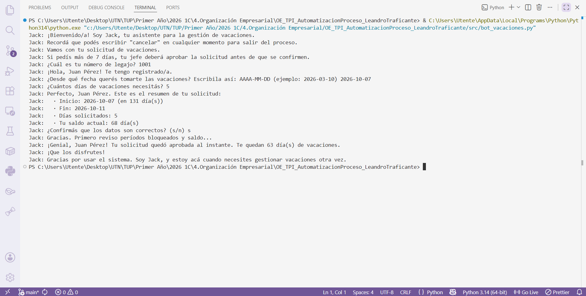
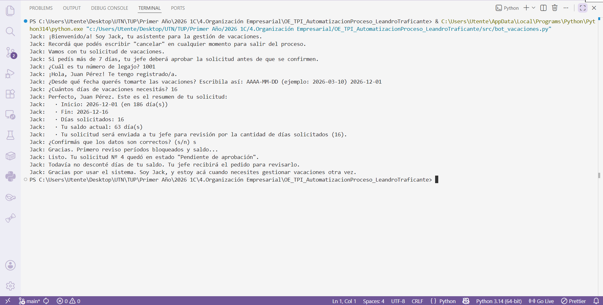
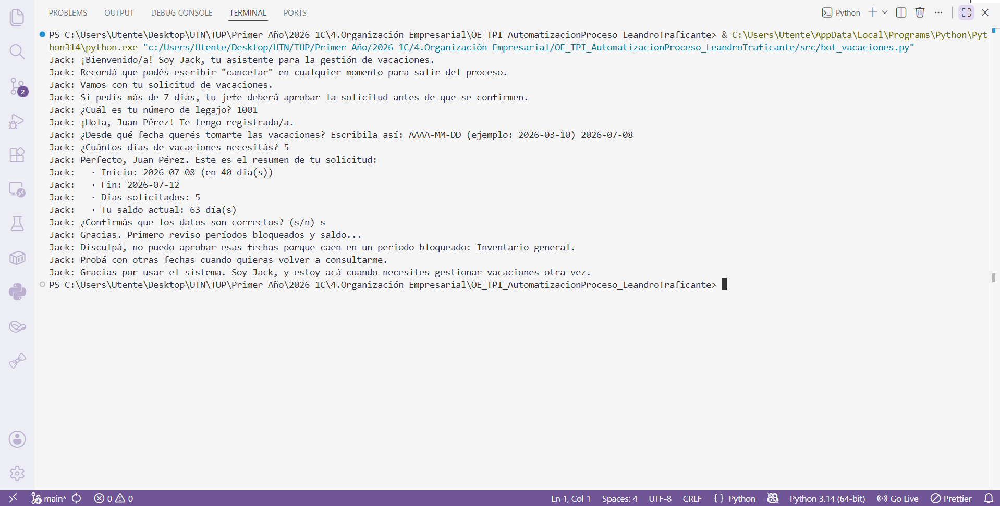
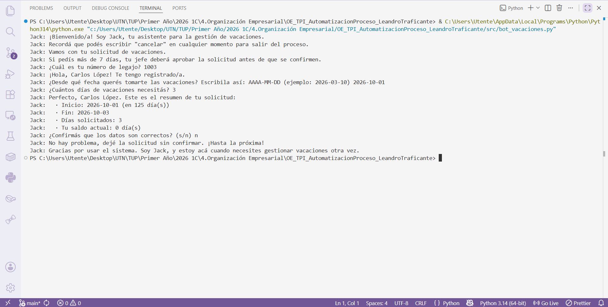
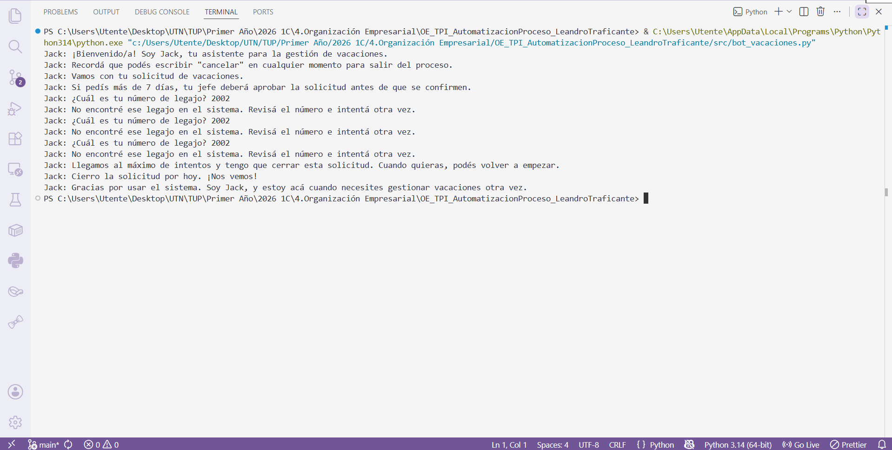
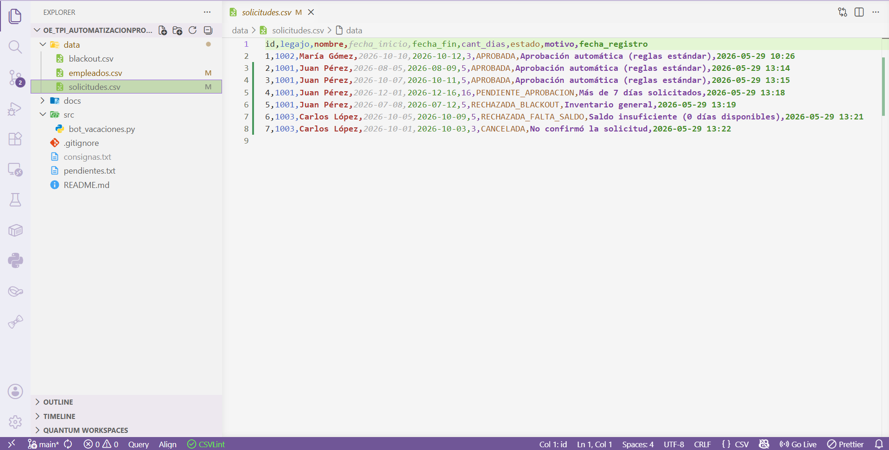
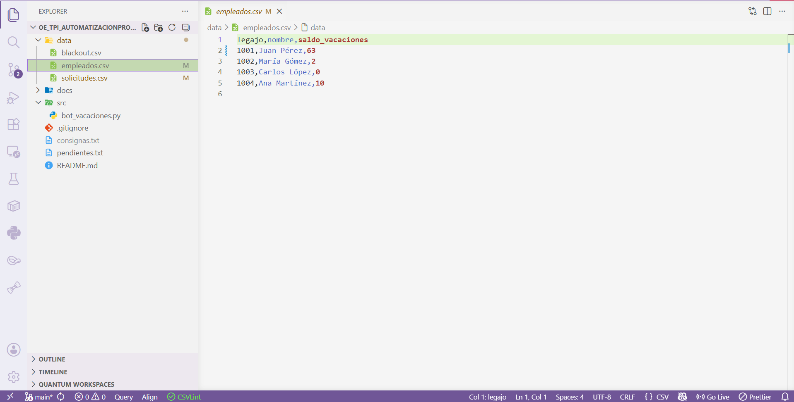

# Pruebas de estrés y validación de caminos alternativos

## 1. Objetivo y alcance

El presente documento registra la verificación manual del simulador **Jack** (`src/bot_vacaciones.py`). Para cada escenario se consigna la secuencia de entrada, el resultado esperado conforme a las reglas de negocio implementadas y la persistencia en los archivos CSV.

**Procedimiento de ejecución:** desde la raíz del proyecto, ejecutar `python src/bot_vacaciones.py` (en Windows, `py src/bot_vacaciones.py` si corresponde).

**Datos de referencia** (saldos iniciales; `data/empleados.csv` puede variar tras ejecutar pruebas):

| Legajo | Nombre       | Saldo (días) |
| ------ | ------------ | ------------ |
| 1001   | Juan Pérez   | 73           |
| 1002   | María Gómez  | 2            |
| 1003   | Carlos López | 0            |
| 1004   | Ana Martínez | 10           |

**Períodos bloqueados** (`data/blackout.csv`): del 2026-07-01 al 2026-07-15 (inventario general); del 2026-12-22 al 2027-01-05 (cierre de fin de año).

**Evidencia gráfica:** capturas en `docs/img/test/`.

---

## 2. Caminos de ejecución nominal (happy path)

| ID  | Escenario                       | Secuencia de entrada                                                | Resultado esperado                                                                   | Registro en `solicitudes.csv` |
| --- | ------------------------------- | ------------------------------------------------------------------- | ------------------------------------------------------------------------------------ | ----------------------------- |
| H1  | Aprobación automática           | Legajo `1001` → fecha `2026-10-10` → días `3` → confirmar `s`       | Mensaje de aprobación; saldo del legajo descontado en 3 días en `empleados.csv`      | Sí (`APROBADA`)               |
| H2  | Pendiente por cantidad de días  | Legajo `1004` → fecha con ≥15 días de anticipación → días `8` → `s` | Estado `PENDIENTE_APROBACION`; saldo del legajo 1004 sin modificación                | Sí                            |
| H3  | Pendiente por poca anticipación | Legajo `1004` → fecha = [FECHA_HOY_MAS_10_DIAS] → días `3` → `s`    | Estado `PENDIENTE_APROBACION` (anticipación inferior a 15 días)                      | Sí                            |

**Figura 1 — Evidencia de aprobación automática (caso H1)**

**Figura 2 — Evidencia de solicitud pendiente de aprobación (caso H2)**

---

## 3. Rechazos por reglas de negocio (posterior a la confirmación)

| ID  | Escenario           | Secuencia de entrada                                 | Resultado esperado                                  | Registro en CSV |
| --- | ------------------- | ---------------------------------------------------- | --------------------------------------------------- | --------------- |
| R1  | Período de blackout | Legajo `1004` → `2026-07-05` → días `3` → `s`        | `RECHAZADA_BLACKOUT`; motivo asociado al inventario | Sí              |
| R2  | Saldo nulo          | Legajo `1003` → fecha válida lejana → días `1` → `s` | `RECHAZADA_FALTA_SALDO`                             | Sí              |
| R3  | Saldo insuficiente  | Legajo `1002` → fecha lejana → días `5` → `s`        | `RECHAZADA_FALTA_SALDO` (saldo disponible: 2)       | Sí              |

**Figura 3 — Evidencia de rechazo por blackout (caso R1)**

**Figura 4 — Evidencia de rechazo por saldo (caso R2)**

---

## 4. Cancelaciones y no confirmación

| ID  | Escenario              | Secuencia de entrada                          | Resultado esperado                                      | Registro en CSV |
| --- | ---------------------- | --------------------------------------------- | ------------------------------------------------------- | --------------- |
| C1  | Cancelación en legajo  | Comando `cancelar` al solicitar legajo        | Finalización del proceso sin nueva fila en el historial | No              |
| C2  | Cancelación en fecha   | Legajo válido → `cancelar` al ingresar fecha  | Igual que C1                                            | No              |
| C3  | No confirmación        | Datos válidos → respuesta `n` en el resumen   | `CANCELADA`; motivo: no confirmación de la solicitud    | Sí              |
| C4  | Cancelación en resumen | Datos válidos → `cancelar` en la confirmación | Equivalente a no confirmación (`CANCELADA`)             | Sí              |

**Figura 5 — Evidencia de cancelación (caso C1)**

---

## 5. Errores de entrada y límite de reintentos

| ID  | Etapa        | Entrada incorrecta (ejemplo)   | Comportamiento esperado                    | Tras tres errores consecutivos      |
| --- | ------------ | ------------------------------ | ------------------------------------------ | ----------------------------------- |
| E1  | Legajo       | `abc` o legajo inexistente     | Mensaje de error; nueva solicitud del dato | `CANCELADA`; sin registro en CSV    |
| E2  | Fecha        | Formato distinto de AAAA-MM-DD | Indicación del formato correcto            | Igual que E1                        |
| E3  | Fecha        | Fecha anterior al día actual   | Rechazo por fecha inválida                 | Igual que E1                        |
| E4  | Días         | `0`, valor negativo o texto    | Solicitud de entero positivo               | Igual que E1                        |
| E5  | Confirmación | Respuesta distinta de `s`/`n`  | Solicitud de confirmación válida           | `CANCELADA`; con registro si aplica |

**Figura 6 — Evidencia de tratamiento de errores de entrada (caso E1)**

---

## 6. Verificación del orden de prioridad de las compuertas

| ID  | Escenario                          | Descripción                                               | Resultado esperado                                                            |
| --- | ---------------------------------- | --------------------------------------------------------- | ----------------------------------------------------------------------------- |
| P1  | Blackout con saldo insuficiente    | Fechas en julio, legajo `1003`, cantidad de días elevada  | Evaluación prioritaria de blackout → `RECHAZADA_BLACKOUT` (sin evaluar saldo) |
| P2  | Saldo suficiente con regla de jefe | Legajo `1001`, ocho días, fecha con anticipación adecuada | Supera blackout y saldo → `PENDIENTE_APROBACION`                              |

---

## 7. Verificación de persistencia de datos

Tras ejecutar pruebas que registran solicitudes y aprobaciones, se constata la actualización de los CSV:

| Archivo                | Verificación esperada                                                      |
| ---------------------- | -------------------------------------------------------------------------- |
| `data/solicitudes.csv` | Historial con estados (`APROBADA`, `PENDIENTE_APROBACION`, rechazos, etc.) |
| `data/empleados.csv`   | Saldos actualizados tras aprobaciones automáticas                          |

**Figura 7 — Evidencia de persistencia en CSV**

